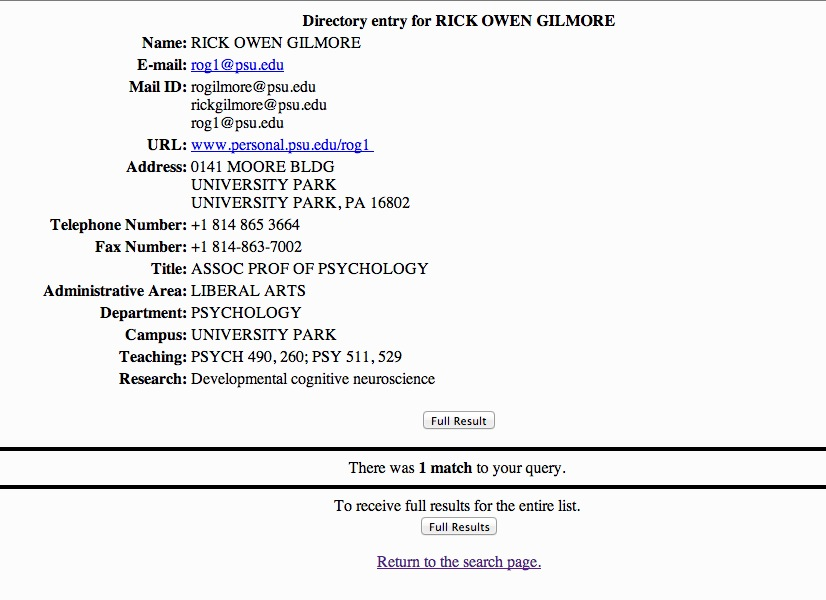

# Databrary
## Principal Investigator, Affiliate Investigator Application Process
			

**Party A is the requesting party and Party B is the authorizing party throughout.**

1. Unauthorized/Unregistered User visits databrary.org/register
1. User registers on Databrary with the following information:
	- Mandatory:
		- Full name (text)
		- Email
		- Institutional affiliation
		- User electronically signs Investigator Agreement
			- Clicks through web-pages of agreement later 
			- Initials sections and checks box at bottom of agreement?
1. Upon registration:
	- Investigator gets confirmation email containing:
		- Copy of e-signed Investigator Agreement
		- Password reset link included to validate email
		- Instructed to request authorization after validating email
		- Other information or links about Databrary?

				Thank you for registering with Databrary. Please click on the link below to validate your email and set your password. Once you've validated your e-mail, you can request authorization by clicking the 'Authorization' link on your profile page.
				
	- Must validate email (with link) before account is created.
1. Upon account creation:
	- User requests authorization through a link on their party page 
	- User instructed to search for party they are requesting authorization. (Institution, if Databrary PI; or Person, if Affiliate)
		a. If party is found in database with administrative account:
			- User selects party
			- Databrary sends notification of authorization request to party via email. 
					
					Message to requesting party:			
					We have sent your authorization request to [Party B]. Once [Party B] authorizes your agreement, you will have access to the data shared within 
					
					Message to authorizing party:
					Dear [Party B],
					
					[Party A] has requested to be authorized by you. To approve this authorization request, you must go to your Admin page and click 'Authorize'. 
					
					
		- If party is found, but no administrative account exists:
			- User selects party
			- User can enter optional fields for contact at sponsored projets offices (as single text field)
			- User is sent confirmation email that authorization request has been made
			
			
					Dear [Party A],
					
					We have received your request to be authorized by [Party 2]. Once they have authorized you, you will be able access the shared data in Databrary! In the meantime, you are able to browse the publicly available information 
					
			- authorize@databrary.org gets notified by email 
			
					Message to authorize@databrary.org goes here
					
					[Party A] has submitted an authorization request for [Party B]
				
		- If no party is found
			- User completes form with the following information:
				- Institution
				- Authorizing Official at Instition (OSP Contact)
					- Name
					- Email
					- Phone Number
					- Address
				- ... 
			- authorize@databrary.org gets this information in an email and uses it to create party.
			- User is sent confirmation email that authorization request has been made
			
					Dear [Party B],
					
					Thank you for submitting a request to be Authorized by [Party that doesn't exist].	We will let you know as soon your application is Authorized.
		
1. Application is now "Pending Authorization"
	
1. Institutional representative or Authorized Databrary PI co-signs agreement
	- authorize@databrary.org registers their authorization with the correct party, if it is for an Institution. 
	- Once agreement is co-signed, applicant status changes to "Authorized" (by authorize@databrary.org for Principal Investigators until administrative accounts for Institutions are active, and by the PI for Affiliates)
	
			Dear [Party A],
			
			Your application for authorization has been approved and you now have full access to the data shared within Databrary. Please remember to abide by our (Best Practices in Data Security)[best-practices.md] and to  to uphold the highest ethical standards of care with Databrary data. 
			
#### At any point after registration (step 2):
	Investigator invited to complete profile via wizard[profile functions will be ready post-beta].
		- Preferred display name (text): 
			- Rick O. Gilmore
		- Preferred institutional display name [shouldn't we have this information?] [save for later]: 
			- Penn State
		- Surface address [shouldn't we have this information?] [do we need this?]: 
			- Department of Psychology
			- The Pennsylvania State University
			- University Park, PA 16802
		- Highest degree:
			- Ph.D.
		- Highest degree institution:
			- Carnegie Mellon University
		- Other email:
			- rogilmore@psu.edu
			- thatrickgilmore@psu.edu
			- rick@databrary.org
		- URL:
			- www.personal.psu.edu/rog1
			- brainlab.psych.psu.edu
		- ORCID ID:
			- http://orcid.org/0000-0002-7676-3982
		- eRA Commons ID:
			- rogilmore
		- Business telephone:
			- 814-865-3664
		- Researchgate.net profile:
			- https://www.researchgate.net/profile/Rick_Gilmore/?ev=hdr_xprf
		- IRB Representative:
			- Tracie Kahler
		- IRB Representative email:
			- tlk14@psu.edu
	- Wishlist:
		- Degree + Institution + Date (multiple)
		- Memberships (multiple)
		- Professional Affiliations (multiple)
		- Leadership Roles (multiple)
		- Collaborators (beyond auto-generated)
		- Projects (beyond auto-generated)
		- Publications (beyond auto-generated)
		- Funding (beyond auto-generated)
		
See sample directory entry from PSU 
