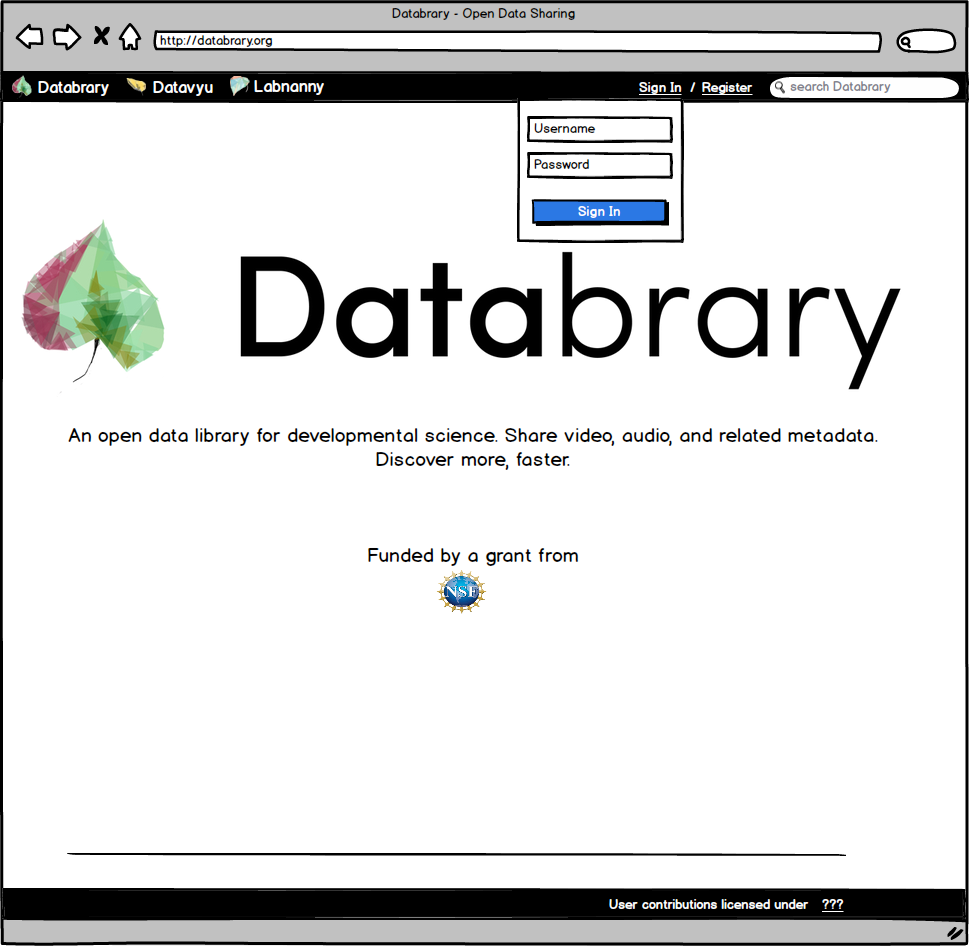

# SRCD Presentation

## Databrary Introduction, Overview

User stories, today

Reuse

## Design

### Process

* Use cases from users to generate design documents
* Organization vs. flexibility: structure, terminology
* Functional description: what should it do?
* Interface descriptions (wireframes): how should it look (layout)?
* Get user feedback, iterate design
* Prototype...

### User stories, wireframes

## Technical

